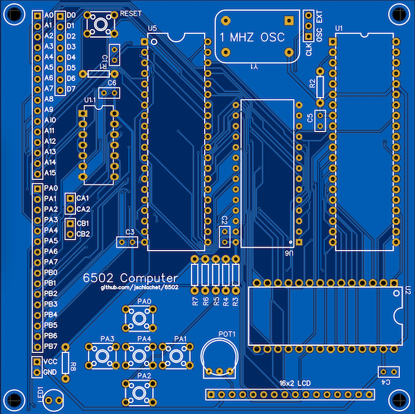

# Printed Circuit Board for 6502 Computer Development

Copyright 2022 Jason Schlachet

## Circuit

I started with Ben Eater's 6502 breadboard schematic. I transcribed it into EasyEDA,
made some personal modifications, and then designed a PCB for it. This board has
been produced at JLCPCB and successfully ran a Hello World application.

 "pcb board front")

